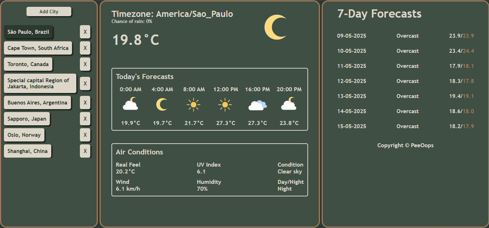

# 🌦️ Weather Dashboard App

A modern, responsive weather dashboard built using **Vanilla JavaScript**, **HTML**, and **CSS**, fetching real-time weather data from the **Open-Meteo API** and geolocation from **OpenStreetMap's Nominatim API**. Designed to showcase weather forecasts and conditions for cities around the world.

---

## 📸 Screenshots




---

## 🚀 Features

- 🔍 **Add cities** by entering city and country name
- 📍 **Save cities** to local storage (persistent across refreshes)
- 🕒 **Today’s forecasts** (6 time points, every 4 hours)
- ☀️ **Current weather conditions** (temperature, humidity, UV index, wind speed, real feel)
- 🌗 **Day/Night display** based on real-time data
- 📆 **7-day forecast UI layout** (Get 7-day weather forecasts with average and apparent temperatures.)
- 🌈 **Dynamic weather icons** based on Open-Meteo weather codes
- 🧠 **Null-safe rendering** and fallback defaults
- 🧱 **Minimal CSS Grid layout**, mobile-friendly

---

## 🧪 Tech Stack

- **Frontend:** Vanilla JavaScript, HTML5, CSS3
- **APIs:**
  - 🌍 [Open-Meteo](https://open-meteo.com/)
  - 🗺️ [Nominatim (OpenStreetMap)](https://nominatim.org/release-docs/latest/api/Search/)

## 📦 Setup

1. Clone the repo:

   ```bash
   git clone https://github.com/your-username/weather-app.git
   cd weather-app
   ```

2. Open index.html in your browser.

## 🧠 How It Works

1. User inputs a city name.
2. The app uses the **Nominatim API** to convert the city name into geographic coordinates (latitude and longitude).
3. With those coordinates, the app sends a request to the **Open-Meteo API** to retrieve the current weather data.
4. The weather data is displayed in the UI.
5. The selected city is stored in the browser's `localStorage` for quick access later.
6. Users can also remove cities from `localStorage`.

